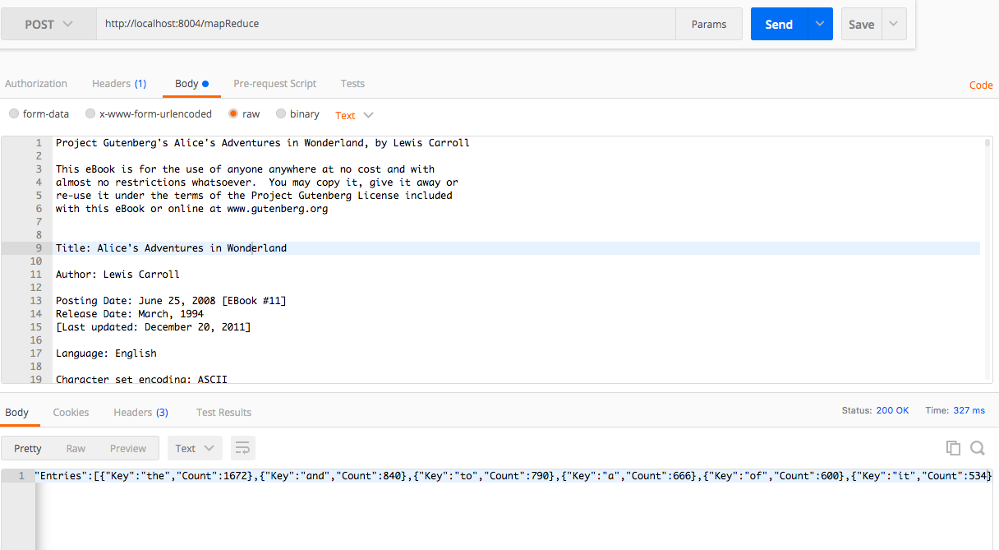

## Node Structure

## Type Of Paxos Consensus

### Const Value Set

#### Each Node will maintain a const value map in an Epoch

## paxos consensus on Const Value Set

#### 1. proposer create prepare a message with key and ID and broad cast 
#### 2. acceptor check whether the key of  this value has already reach consensus if it is already decided, the acceptor will send back the decided value with a consensus flag
#### 3. if not ,the acceptor check whether the ID of this Key is the biggest one he saw in this Epoch, If the ID is the biggest one on this key, the acceptor will send promise message
##### 2a If the acceptor has already accept a value on this key, it will promise this message with the accepted value, on other case the acceptor will promise with an empty value
#### 4. When the proposer got majority of promise, he will check if the value of promise if it already has a value, the proposer will propose the value with the biggest acceptor_id, otherwise, the proposer will propose his own value
#### 5. When the acceptor got the proposal, he will compare the ID of the proposal with he previously promised ID if it is equal, the acceptor will broadcast accept message
#### 6. When each node got majarity of accept message on same value and key in this Epoc the consensus of this key reached, update the const table
#### 7. Especially If the Const Key is LEADER, the cluster will decided that value as the LEADER Node

## paxos consensus on change leader

#### 1.When a proposer could not detect leader heart beat it will prepare a change leader request
#### 2.Once an acceptor receive this message he will test heart beat on the leader, if the leader is dead he will send broadcast the accept message 
#### 3.If majority reached, the Const Table will be cleared and Epoch ++
#### 4.the rest of the node will begin select leader again

## paxos consensus on Kick Off

#### Once a member could not detect one's heart beat it will prepare a kick off message and send to leader
#### The leader will check on that node, if it is dead the leader will send propose
#### Once Majority reached, the node will be removed from the peer list

## paxos consensus on Data Synchronize

#### Once a member need to synchronize a record, it will first create a prepare message with key to the leader,
#### Once the leader receive this message, it will recreate a prepare message with key and broadcast.
#### Once an acceptor receive a prepare of data sync message he first check if it is from leader if not,ignore it.if it is it will check on his own db and send the version of that record and his node_id in the promise
#### Once the leader receive all promise from the member, he will than propose the node_id with the highest version on that record
#### Once receive all the accept message the node will compare his record version with the highest version, if his version is lower, the node will ask for owner of the latest record

## Node Start up

#### 1. Wait For the starter node's health check service on
#### 2. Nodes peer shake hands, Introduce service address and service port to each other
#### 3. Once the cluster member is bigger than 3 the nodes will first start Election for leader using paxos algorithm
#### 4. Once leader selected each member will build heart beat connect to the leader
#### 5. Once leader Confirmed the members will open worker Service and Data transfer service and start to synchronize the undone maintask list

## Data Structure

## Processing

### 1. Once a Node Receive a request, first check if he is leader if he is leader, divide the main task into small pieces of subtasks and arrange to peers, create the main task, sub task and undone main task, save to level db and prepare synchronize the record to the cluster

### 2. Once a member receive the update undone main task, subtask or undone main task, start a cycle pick up his own subtask and start run 

### 3. Once a member finish the subtask, create subtask result and start synchronize consensus on taskStatus and task result

### 4. Once the leader synchronized all the result of the subtask start merge and save the final result to local db and send the final result back to client and synchronize the undone task list

## Failure Cases

## 2. Leader Dead

### The task data was synchronized among nodes so every one almost have the latest version of data except in some cases, so everyone could be the leader 

###  When the leader Dead, cluster will detecte and start elect a new leader.
###  When the new leader come up he will first detect the dead node and kick him off
###  Then the new leader will start synchronize undone main tasks among nodes, if the old leader cannot synchronize  his newest version of undone task, the task will be lost however the consensus will be continued because when the old leader came back online, he will either publish his version (if it is higher ) or use the cluster's version of undone task

## 3. Member Dead

### When the member Dead, leader will first detect and kick him off. Than the leader will check undone tasks to see whether this node has any undone subtasks, if it has, the leader will create a new subtask on the maintask and synchronize the record.Since leader will not update the old subtask.When the old node come back. it will receive the new arranged undone main task,the consensus will continue and the old subtask will not rerun and no version conflict

Configuration File

<code>

{
  "Addr": "localhost:7001",  // Paxos Consensus Channel
  "HeartBeatAddr" : "localhost:7002", // Hello Message and Heart beat
  "StarterPeerAddr" : null, // the starter's hello channel of this peer 
  "DataTransferAddr" : "localhost:7003", // Data synchronize channel
  "HttpServiceAddr": "localhost:8002", // http service channel, each nodes has an http service and they could provide service 
  "NodeId": "0", // Unique Node Id (Number)
  "DataSetPath" : "/Users/liwei/Desktop/goProject/distributeWordSplit/dataSet1"   // directory path for leveldb
}
</code>

### Http Service url /mapReduce 

### Start Server 

#### Remove the .bin extension on go_build_main_go

./go_build_main_go [configuration.json]

